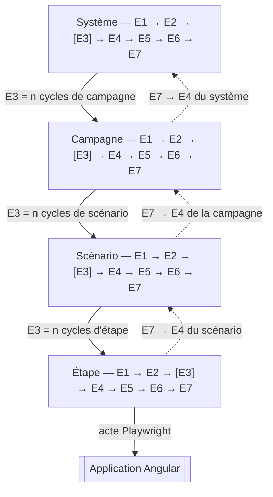
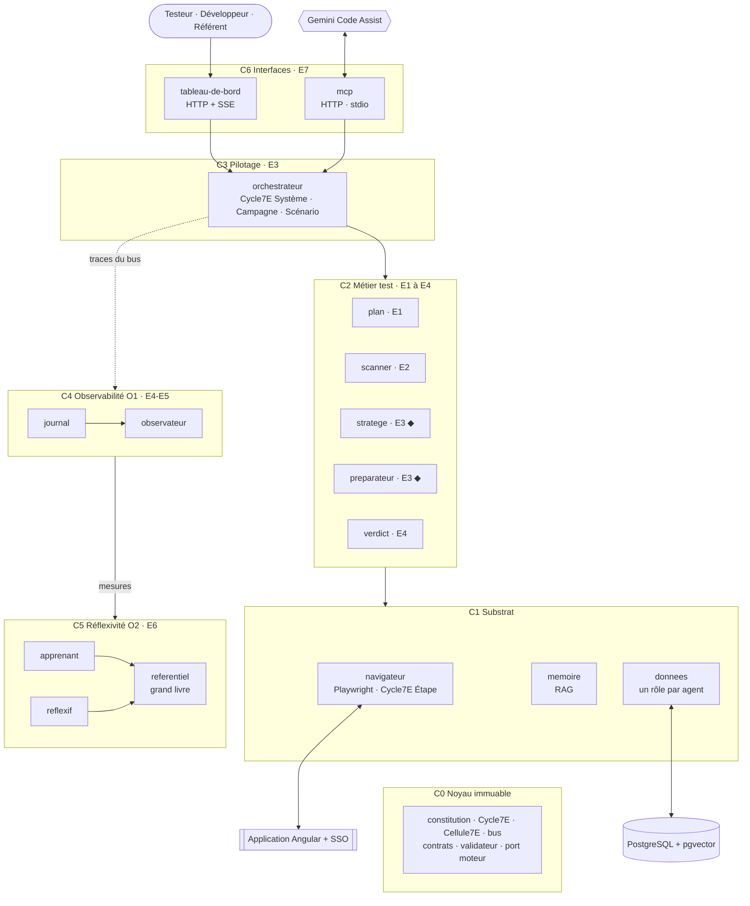
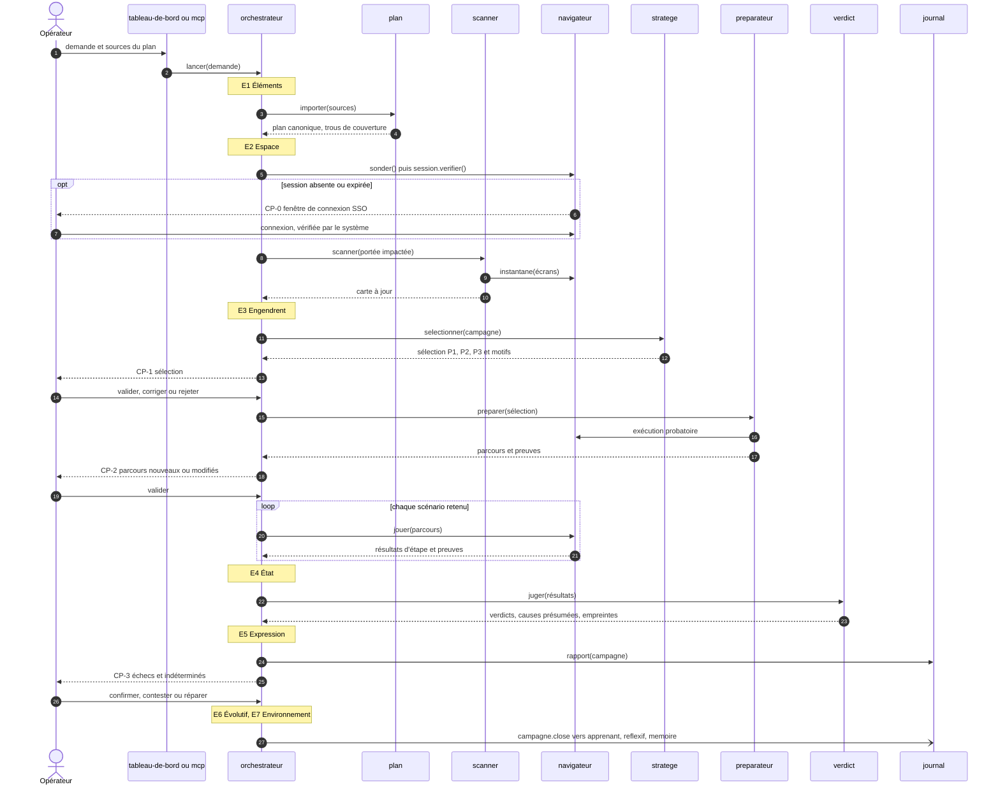
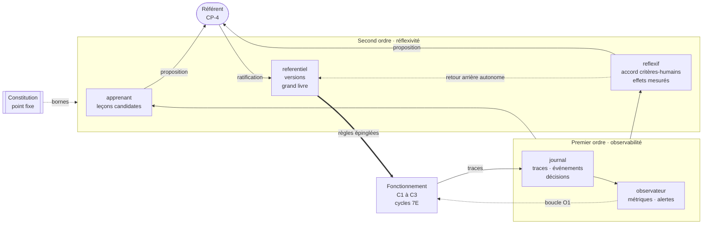
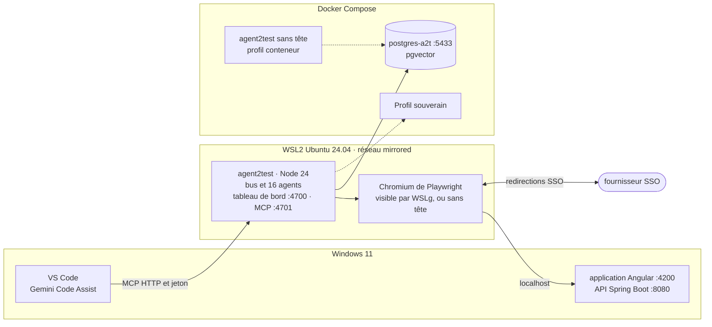

# Agent2Test — Architecture globale

> Étape 1 sur 7 · proposition soumise à ratification · 25 septembre 2026
> Hypothèses (H), tensions (T) et plan des étapes : [`00-cadrage.md`](00-cadrage.md)

1. Principe directeur
2. Le noyau : fractale 7E
3. Couches et modules
4. Interfaces
5. Flux et points de contrôle
6. Cybernétique : premier et second ordre
7. Sélection des tests essentiels
8. Données, mémoire et RAG
9. Sécurité et gouvernance des données
10. Conformité AI Act
11. Déploiement
12. Registre des décisions
13. Filiation avec le banc et Agent2Dev

---

## 1. Principe directeur

**Le moteur conçoit, le noyau exécute, l'humain ratifie.**

- Le moteur (Gemini Code Assist par défaut, tout LLM par le port moteur) ne produit que des données : une sélection argumentée, des parcours, des leçons candidates. Chaque sortie est validée contre un schéma fermé et des contrôles nommés.
- Seuls des agents déterministes agissent : `navigateur` sur l'IHM, `donnees` sur PostgreSQL. Le moteur n'a accès ni au navigateur ni à la base.
- Un parcours ratifié se rejoue sans moteur. Le LLM intervient à la conception et à la réparation, jamais pendant l'exécution : un verdict qui ne se reproduit pas ne prouve rien.
- L'humain ratifie aux points de contrôle CP-0 à CP-4. Entre deux points, les agents avancent seuls.

Le problème résolu — quels tests sont essentiels pour cette demande — est porté par un agent dédié, le `stratege` (§7). Les deux agents demandés sont le `scanner` et le `preparateur`, chargé de la mise en place Playwright.

---

## 2. Le noyau : fractale 7E

### 2.1 L'axiome rendu opératoire

> Les **É**léments dans l'**E**space **E**ngendrent un **É**tat d'**E**xpression **É**volutif de l'**E**nvironnement.

| Phase | Terme | Opération | Question | Produit |
|---|---|---|---|---|
| E1 | Éléments | Recenser | De quoi dispose-t-on ? | éléments validés, figés pour le cycle |
| E2 | Espace | Situer | Où, et avec quoi, ces éléments agissent-ils ? | contexte : carte, session, mémoire, règles épinglées |
| E3 | Engendrent | Produire | Que fait-on advenir ? | sélection, parcours, action — la récursion descend ici |
| E4 | État | Constater | Qu'est-il advenu, par rapport à l'attendu ? | état mesuré, écart, verdict |
| E5 | Expression | Exprimer | Comment le rendre lisible et opposable ? | ligne de journal, preuve, rapport |
| E6 | Évolutif | Ajuster | Que faut-il changer, et à quel ordre ? | correction immédiate (O1) ou proposition de règle (O2) |
| E7 | Environnement | Coupler | Que rend-on au niveau englobant, que reçoit-on de lui ? | résultat remonté ; perturbation reçue, qui devient l'E1 du cycle suivant |

**Règle de récursion (invariant I1)** : l'E3 d'une échelle *n* est la suite des cycles complets de l'échelle *n − 1* ; l'E7 de chaque cycle de l'échelle *n − 1* alimente l'E4 de l'échelle *n*.

### 2.2 Quatre échelles, une seule classe de cycle

| Phase | Étape | Scénario | Campagne | Système |
|---|---|---|---|---|
| E1 | action, cible, valeur | étapes, données, critères couverts | demande, US, critères, scénarios | fiches, règles, seuils, constitution |
| E2 | page courante, résolution de la cible | session SSO, URL d'entrée, données préfixées | carte applicative, mémoire, référentiel épinglé | file des campagnes, verrous de ressources, versions actives |
| E3 | acte Playwright | cycles d'étapes | sélection → parcours → cycles de scénarios | cycles de campagnes |
| E4 | observation (DOM, ARIA, réseau, console) contre assertion | verdict par critère | matrice critères × verdicts, couverture | métriques de fonctionnement (O1) |
| E5 | ligne de journal + preuve | compte rendu de scénario | journal de tests (Markdown, JSON, JUnit) | tableaux de bord |
| E6 | attente, alternative déclarée (O1) | nouvel essai, soupçon d'instabilité (O1) | réparation proposée, leçons candidates | réflexivité (O2) : mesure, recalibrage, retour arrière |
| E7 | résultat remonté au scénario | résultat remonté à la campagne | rapport aux équipes, indexation en mémoire | gouvernance humaine, évolution de l'application |

Le cycle est une seule classe du noyau, `Cycle7E`, à sept méthodes. L'orchestrateur l'instancie pour les échelles Système, Campagne et Scénario ; le navigateur l'instancie pour l'échelle Étape, au plus près de la page. Il n'y a donc pas un orchestrateur par niveau : une échelle est une spécialisation de `Cycle7E`, pas un module (D4).



### 2.3 Deuxième axe : les organes

Chaque agent traite chaque message comme un cycle 7E ; sa classe de base, `Cellule7E`, en fixe la forme :

| E1 | E2 | E3 | E4 | E5 | E6 | E7 |
|---|---|---|---|---|---|---|
| valider l'entrée contre le contrat | charger fiche épinglée, mémoire, règles | agir : outil, moteur, requête | valider la sortie : schéma, contrôles | répondre, publier | corriger dans le budget O1 | remettre la trace au bus |

La trace de chaque appel porte le vecteur de ses sept durées. Un agent déterministe laisse vides les phases sans objet ; la forme ne change pas.

### 2.4 Troisième axe : les couches

À l'échelle Système, chaque couche porte une phase dominante (§3). L'observabilité (O1) est l'E4 du Système : elle constate son état. La réflexivité (O2) en est l'E6 : elle le fait évoluer.

### 2.5 Où l'invariant se voit

| Lieu | Forme visible |
|---|---|
| Code | `Cycle7E` et `Cellule7E` dans le noyau ; toute échelle et tout agent en héritent |
| Données | chaque ligne de journal porte `echelle` et `phase` ; une campagne se relit comme un arbre 7E imbriqué |
| IHM | chaque campagne s'affiche en roue 7E, dépliable jusqu'à l'étape |
| Gouvernance | toute proposition de changement nomme l'échelle et la phase qu'elle modifie |

---

## 3. Couches et modules



◆ agent cognitif (appelle le port moteur). Toutes les flèches passent par le bus ; aucun agent n'importe un autre agent. O1 et O2 observent l'ensemble du fonctionnement à travers les traces du bus ; leurs boucles sont détaillées au §6.5.

| Couche | Module | Responsabilité unique | Schéma possédé | Moteur | Phase |
|---|---|---|---|---|---|
| C0 Noyau | `constitution`, `cycle7e`, `cellule`, `bus`, `contrats`, `validateur`, `moteurs` | bibliothèque immuable, aucun agent | — | — | toutes |
| C1 Substrat | `donnees` | seul accès PostgreSQL : contrats nommés, un pool et un rôle par agent | — | non | transverse |
| | `memoire` | RAG hybride, mémoire sémantique persistante | `memoire` | non | E2 |
| | `navigateur` | seul propriétaire de Playwright : session SSO, origines autorisées, preuves, cycles Étape | `execution` | non | E3 |
| C2 Métier | `plan` | ingérer demande, US, critères, scénarios → plan canonique | `plan` | non | E1 |
| | `scanner` | seul lecteur des sources du projet ; cartographier l'application (sources Angular et Spring, IHM en marche) | `scan` | option | E2 |
| | `stratege` | choisir les tests essentiels, motivés et priorisés | `strategie` | oui | E3 |
| | `preparateur` | mettre en place l'exécution : profil d'environnement, parcours Playwright, exécution probatoire, réparation | `preparation` | oui | E3 |
| | `verdict` | juger, nommer la cause présumée, sceller la preuve | `verdict` | non | E4 |
| C3 Pilotage | `orchestrateur` | dérouler les cycles 7E Système, Campagne, Scénario ; tenir la file, les verrous et les points de contrôle | `orchestration` | non | E3 |
| C4 Observabilité O1 | `journal` | consigner et chaîner ; projeter le journal de tests | `journal` | non | E5 |
| | `observateur` | mesurer le fonctionnement, alerter | `observation` | non | E4 |
| C5 Réflexivité O2 | `apprenant` | tirer des leçons candidates des décisions humaines | `apprentissage` | option | E6 |
| | `reflexif` | observer critères, observateurs et apprentissages ; proposer des recalibrages ; déclencher les retours arrière | `reflexion` | non | E6 |
| | `referentiel` | versionner fiches et règles, épingler par campagne, appliquer le ratifié, tenir le grand livre | `referentiel` | non | E6 |
| C6 Interfaces | `tableau-de-bord` | IHM opérateur HTTP + SSE, vues par rôle | — | non | E7 |
| | `mcp` | serveur MCP pour Gemini Code Assist | — | non | E7 |

Règles de composition :

- Un schéma a un seul propriétaire. Un agent ne lit les données d'un autre qu'en appelant une de ses actions.
- Les agents cognitifs (`stratege`, `preparateur` ; en option `scanner` et `apprenant`) sont une seule classe pilotée par des fiches versionnées, dans la lignée de l'`AgentGenerique` d'Agent2Dev.
- Chaque module se désactive par configuration. Le palier minimal exécutable — noyau, `donnees`, `journal`, `plan`, `navigateur`, `preparateur`, `verdict`, `orchestrateur` et une interface — rejoue des parcours ratifiés ; les autres modules s'ajoutent par paliers (roadmap, étape 3).

Une responsabilité, un seul lieu :

| Responsabilité | Lieu unique |
|---|---|
| lire les sources du projet | `scanner` |
| piloter un navigateur | `navigateur` |
| accéder à PostgreSQL | `donnees` |
| appeler un LLM | port moteur du noyau, via les agents cognitifs |
| valider une sortie | `validateur` du noyau |
| dérouler un cycle | `Cycle7E` du noyau |
| écrire le journal | `journal` |
| stocker des vecteurs | `memoire`, dans la même base (pas de base vectorielle séparée) |
| versionner une règle | `referentiel` |

---

## 4. Interfaces

### 4.1 Bus

API héritée du banc et d'Agent2Dev :

```js
bus.demander(cible, action, charge, contexte, { delaiMs }) // appel nommé : réponse, trace, délai de garde
bus.publier(type, charge, contexte)                         // événement sans réponse
bus.tracer(fn)                                              // reçoit chaque appel terminé, succès ou échec
bus.abonner(fn)                                             // reçoit chaque événement
```

Contexte propagé : `{ correlation, campagne, echelle, phase, parent, appelant }`. `parent` construit l'arbre des traces ; `appelant` permet à `donnees` de choisir le rôle PostgreSQL. Chaque agent déclare son contrat — actions, schémas d'entrée et de sortie, événements émis — et le bus refuse tout appel non déclaré.

### 4.2 Contrats principaux

Le détail des schémas relève de l'étape 2.

| Agent | Actions | Événements émis |
|---|---|---|
| `plan` | `importer(sources)`, `plan(campagne)`, `criteres(filtre)` | `plan.importe`, `plan.trou_couverture` |
| `scanner` | `scanner({ mode, portee })`, `carte(filtre)`, `impact(changements)`, `configuration()` | `carte.mise_a_jour` |
| `memoire` | `indexer(documents)`, `rechercher(requete, filtres, k)` | — |
| `navigateur` | `sonder()`, `session.verifier()`, `session.etablir()`, `instantane(url)`, `resoudre(cibles)`, `jouer(parcours)` | `session.expiree`, `etape.jouee` |
| `stratege` | `selectionner(campagne)` | `selection.proposee` |
| `preparateur` | `amorcer(projet)`, `preparer(selection)`, `reparer(parcours, diagnostic)` | `parcours.propose` |
| `verdict` | `juger(resultats)` | `verdict.rendu` |
| `donnees` | `executer(contrat, parametres)` | — |
| `journal` | `consulter(filtre)`, `rapport(campagne, format)`, `verifierChaine()` | — |
| `observateur` | `mesures(filtre)` | `alerte` |
| `apprenant` | `lecons(filtre)` | `lecon.candidate` |
| `reflexif` | `bilan(filtre)` | `proposition.recalibrage`, `retour.arriere` |
| `referentiel` | `fiche(code, moteur)`, `epingler(campagne)`, `appliquer(decision)`, `revenir(version)`, `grandLivre(filtre)` | `regle.appliquee` |
| `orchestrateur` | `lancer(demande)`, `decider(point, decision)`, `suspendre(campagne)`, `etat(campagne)` | `point.ouvert`, `campagne.close` |

### 4.3 Port moteur

```js
moteur.completer({ systeme, message, schema, fiche, version }) // → { texte, usage }
```

| Adaptateur | Usage |
|---|---|
| `simulation` | déterministe, sans réseau : essais, démonstrations, tests d'Agent2Test |
| `externe` (MCP) | Gemini Code Assist en mode agent, par défaut (H4) : la rédaction attend que Gemini soumette sa sortie |
| `compatibilité` | tout serveur exposant et tout service autorisé |

Chaque appel est journalisé avec : fiche et version composée, moteur, empreinte SHA-256 du prompt rendu, identifiants des fragments de mémoire injectés, usage.

### 4.4 MCP : Gemini Code Assist

Même montage qu'Agent2Dev : Agent2Test est le serveur, Gemini le moteur. Gemini lit `~/.gemini/settings.json` (clé `mcpServers`).

| Outil | Rôle |
|---|---|
| `a2t_demarrer_campagne` | ouvre une campagne à partir d'une demande et des sources du plan |
| `a2t_tache_suivante` | renvoie la prochaine rédaction attendue (rôle, consignes, leçons, schéma, contexte borné) ou le point de contrôle à présenter à l'opérateur |
| `a2t_soumettre` | soumet une sortie ; renvoie les écarts de validation (boucle O1) ou l'acceptation |
| `a2t_decider` | relaie la décision de l'opérateur pour CP-0 à CP-3 |
| `a2t_suspendre` | arrêt d'urgence d'une campagne |
| `a2t_etat`, `a2t_journal`, `a2t_rapport`, `a2t_carte` | lecture seule |

- **Transports** : HTTP en flux sur `127.0.0.1` avec jeton porteur (clé `httpUrl` et en-tête `Authorization`), par défaut ; stdio (clé `command`) en repli, pour la parité avec Agent2Dev (D13).
- **Règles** : `GEMINI.md` interdit à Gemini de décider à la place de l'opérateur. Les décisions CP-4 sont refusées sur le canal MCP : un moteur ne ratifie pas ses propres leçons (I10). L'arrêt d'urgence reste permis, parce qu'il va dans le sens sûr.

### 4.5 HTTP et SSE : tableau de bord

Écoute sur `127.0.0.1:4700`. IHM en HTML et JavaScript natifs, sans cadre, utilisable au clavier et au lecteur d'écran.

| Rôle (H11) | Vues |
|---|---|
| Testeur | campagnes ; points de contrôle avec preuves côte à côte ; journal en arbre 7E |
| Développeur | défauts applicatifs présumés : étapes de reproduction, captures, trace Playwright, erreurs réseau et console |
| Référent qualité, DSI | gouvernance O2 : propositions, grand livre, effets des leçons, accord entre critères et humains ; indicateurs O1 ; fiche de registre IA |

### 4.6 Formats pivots

| Format | Producteur | Consommateurs |
|---|---|---|
| plan canonique | `plan` | `stratege`, `preparateur`, `verdict` |
| carte applicative | `scanner` | `stratege`, `preparateur`, `mcp` |
| profil d'environnement | `preparateur` (ratifié en CP-2) | `navigateur` |
| sélection | `stratege` | `orchestrateur`, `preparateur` |
| parcours | `preparateur` | `navigateur` |
| résultat d'étape | `navigateur` | `verdict`, `journal` |
| verdict | `verdict` | `journal`, `orchestrateur`, `apprenant` |
| proposition de règle | `apprenant`, `reflexif` | `referentiel`, après CP-4 |
| ligne de journal | `journal` | `observateur`, `reflexif`, `tableau-de-bord` |

Un parcours est une donnée. Exemple :

```json
{
  "id": "contrats/P-12.1",
  "version": 3,
  "scenario": "contrats/S-12.1",
  "criteres": ["contrats/CA-12.1", "contrats/CA-12.2"],
  "origine": { "moteur": "gemini", "fiche": "preparateur@1.0.0+L4", "ratifiePar": "testeur", "ratifieLe": "2026-09-25" },
  "donnees": { "libelle": "A2T-{campagne}-contrat" },
  "etapes": [
    { "n": 1, "action": "naviguer", "url": "/contrats" },
    { "n": 2, "action": "cliquer", "cible": { "role": "button", "nom": "Nouveau contrat" } },
    { "n": 3, "action": "saisir", "cible": { "label": "Libellé" }, "valeur": "{libelle}" },
    { "n": 4, "action": "cliquer", "cible": { "role": "button", "nom": "Enregistrer" }, "mutation": "creation" },
    { "n": 5, "action": "verifier", "critere": "contrats/CA-12.1",
      "cible": { "role": "alert" }, "attendu": { "contient": "Contrat créé" } },
    { "n": 6, "action": "verifier", "critere": "contrats/CA-12.2",
      "cible": { "role": "row", "contient": "{libelle}" }, "attendu": { "visible": true } }
  ]
}
```

- **Actions fermées** : `naviguer`, `cliquer`, `saisir`, `choisir`, `cocher`, `survoler`, `touche`, `televerser`, `attendre` (un état, jamais une durée), `verifier`. Il n'existe ni `script` ni `evaluate` : aucun code du moteur n'atteint la page.
- **Stratégies de ciblage, par ordre de préférence** : rôle et nom accessible, libellé, identifiant de test, texte, texte indicatif, CSS. CSS n'est admis qu'en dernier recours et il est signalé comme fragile. Les localisateurs de Playwright sont stricts : une cible ambiguë échoue au lieu de cliquer au hasard.
- **Traçabilité** : chaque critère couvert par le parcours doit être porté par au moins une étape `verifier`.

### 4.7 Le journal de tests (livrable)

Projection du journal pour une campagne :

- en-tête : demande, versions épinglées, moteur, opérateurs ;
- sélection : paliers, motifs, tests écartés, trous de couverture ;
- matrice critères × verdicts ;
- détail par scénario et par étape : action, cible, résultat, durée, preuve ;
- causes présumées, décisions et désaccords humains ;
- mesures O1 de la campagne ;
- mentions d'origine IA (I14) ;
- empreinte de fin de chaîne, vérifiable.

Formats : Markdown pour les humains, JSON pour les outils, JUnit XML pour GitLab CI, HTML dans le tableau de bord.

---

## 5. Flux et points de contrôle

### 5.1 Campagne nominale



### 5.2 Points de contrôle

| CP | Moment | Qui | Décisions | Ce qui attend |
|---|---|---|---|---|
| CP-0 Session | session SSO absente ou expirée | l'opérateur | se connecter dans la fenêtre ouverte ; le système vérifie seul la session obtenue | tout accès à l'IHM |
| CP-1 Sélection | après la sélection (E3) | testeur | valider · corriger, commentaire obligatoire · rejeter | la préparation |
| CP-2 Mise en place | profil d'environnement au premier passage ; parcours nouveaux ou modifiés, après exécution probatoire | testeur ou développeur | valider · corriger · rejeter | leur exécution en campagne |
| CP-3 Verdicts | après E4, pour les échecs et les indéterminés | testeur | confirmer · contester — le désaccord est consigné à côté du verdict, qui n'est pas réécrit · demander une réparation | la clôture |
| CP-4 Gouvernance | proposition de règle : leçon, recalibrage | référent qualité, depuis le tableau de bord seulement | ratifier · amender · refuser | rien : asynchrone, effet à la campagne suivante |

Un parcours ratifié et inchangé ne repasse pas par CP-2. Le niveau d'autonomie de chaque point (présenter tout, présenter l'écart seulement) est fixé par une configuration humaine que le système ne peut pas modifier (I8).

### 5.3 Causes présumées et boucle de réparation

| Cause | Signal | Suite |
|---|---|---|
| `DEFAUT_APPLICATIF` | cible résolue, action jouée, assertion contredite | vue développeur ; confirmation en CP-3 |
| `DEFAUT_PARCOURS` | cible introuvable ou ambiguë, donnée refusée par le formulaire | réparation par le `preparateur`, dans un budget borné, puis CP-2 |
| `SESSION_EXPIREE` | redirection vers l'origine du fournisseur SSO | CP-0, puis reprise du scénario ; aucun échec imputé |
| `ENVIRONNEMENT` | application injoignable, réponse 5xx hors mutation, délai réseau | campagne suspendue si récurrent |
| `INSTABILITE` | échec puis succès au réessai, à l'identique | au-delà du seuil, quarantaine proposée en CP-4 ; un scénario en quarantaine reste joué et rapporté à part |
| `INDETERMINE` | aucun signal discriminant | CP-3 |

Pour une réparation, l'opérateur peut aussi désigner l'élément directement dans le navigateur, avec le sélecteur interactif de Playwright (`page.pickLocator()`, version 1.59 et suivantes).

### 5.4 Session SSO

| Stratégie | Principe | Quand |
|---|---|---|
| `profil` (défaut) | contexte persistant dans un répertoire dédié ; l'humain se connecte une fois (CP-0) ; le cookie du fournisseur SSO rend les reconnexions silencieuses | OIDC ou SAML, avec ou sans MFA |
| `cdp` | rattachement à un Chrome déjà ouvert et connecté (`connectOverCDP`) | connexion possible seulement dans le navigateur de l'utilisateur |
| `etat` | état importé : cookies, `localStorage`, IndexedDB, et `sessionStorage` si le jeton y réside | profil conteneur, recette sans tête |

L'expiration se détecte par une redirection vers l'origine du fournisseur SSO. Elle donne la cause `SESSION_EXPIREE`, jamais un échec de test.

---

## 6. Cybernétique : premier et second ordre

### 6.1 La distinction

| | Premier ordre — observabilité | Second ordre — réflexivité |
|---|---|---|
| Objet observé | le fonctionnement : appels, étapes, durées, erreurs | les règles, les critères d'évaluation, les observateurs, l'apprentissage |
| Question | le système fait-il ce qu'il doit ? | ses manières de juger et d'apprendre sont-elles justes ? |
| Modules | `journal`, `observateur`, vue O1 du tableau de bord | `apprenant`, `reflexif`, `referentiel` (grand livre) |
| Sorties | logs, métriques, traces, alertes, tableaux de bord | mesures d'accord, effets mesurés, propositions de recalibrage, retours arrière, mémoire réflexive |
| Action permise | corriger dans un budget fixé : réessai, alternative déclarée, renvoi au moteur avec ses écarts | proposer ; revenir seul à un état ratifié ; jamais adopter seul |
| Dépendance | ignore l'existence d'O2 | lit O1, ne l'écrit jamais |

### 6.2 Premier ordre (O1)

- **Logs** : journal en ajout seul, une ligne par appel et par événement, avec `echelle`, `phase` et vecteur 7E.
- **Traces** : corrélation et parent donnent l'arbre Système › Campagne › Scénario › Étape ; export OpenTelemetry (OTLP) en option.
- **Métriques** :
  - par agent, phase et échelle : volumes, durées p50 et p95, taux d'erreur ;
  - par scénario : taux de réussite, taux d'instabilité ;
  - par campagne : couverture des critères, répartition des verdicts ;
  - par appel au moteur : jetons, renvois pour non-conformité ;
  - par point de contrôle : taux de validation, de correction, de rejet, et délai de décision.
- **Tableaux de bord** : flux SSE en direct.
- **Alertes** : dérive d'un indicateur au-delà d'un seuil.
- **Preuves Playwright** : captures masquées, instantanés ARIA, traces (`trace.zip`), HAR en option.

### 6.3 Second ordre (O2)

| Exigence | Mise en œuvre |
|---|---|
| Observer les modèles et les critères d'évaluation eux-mêmes | Pour chaque contrôle automatique — schémas, contrôles nommés, règles de cause, poids de sélection, score des sorties — mesure de l'accord avec la décision humaine aux points de contrôle, par fiche, version et moteur. Un critère souvent contredit est déclaré mal calibré. |
| Observer les observateurs | Précision des alertes O1 (reconnues pertinentes ou rejetées) et incidents signalés par un humain sans alerte préalable. Le `reflexif` est lui-même observé : propositions acceptées, effets mesurés après adoption, visibles dans la vue gouvernance. |
| Recalibrer les boucles de rétroaction | Propositions bornées sur les seuils, budgets de réessai, poids de sélection, paramètres RAG. Chacune porte ses preuves et l'effet attendu. |
| Auto-modification contrôlée des règles | Cycle de vie d'une règle : candidate → ratifiée → active → suspendue ou retirée. Adoption seulement en CP-4 ; retour arrière autonome si la mesure se dégrade. |
| Mémoire réflexive de l'évolution | Grand livre du `referentiel` : chaque version, sa cause, ses preuves, sa ratification, son effet mesuré, ses retours arrière ; chaîné par empreintes. |

**Garde anti-Goodhart.** Un système qui apprend peut apprendre à satisfaire ses indicateurs plutôt que son but. Deux dérives sont prévisibles ici : classer un défaut applicatif en défaut de parcours pour gonfler la réussite, et sélectionner moins de tests pour finir plus vite. La sémantique réussi / échoué (I5) et les paliers obligatoires de sélection (I15) sont donc constitutionnels. Le `reflexif` croise en outre la répartition des causes avec les reclassements humains en CP-3 : toute divergence alerte le référent.

### 6.4 Niveaux d'apprentissage (Bateson)

| Niveau | Nature | Dans Agent2Test | Qui décide |
|---|---|---|---|
| 0 | réponse fixe | attente automatique de Playwright, actions déterministes | personne |
| I | correction dans un ensemble fixe d'alternatives | réessai, alternative de cible déclarée, renvoi au moteur avec ses écarts | le système, dans un budget |
| II | changement de l'ensemble des alternatives : apprendre à apprendre | leçons injectées dans les fiches, poids et seuils recalibrés | proposé par le système, ratifié par l'humain (CP-4) |
| III | changement du système des ensembles | constitution, critères d'O2, définition des points de contrôle | l'humain seul, par version publiée |

### 6.5 Auto-modification asymétrique

- **Le système peut, seul** : suspendre une leçon ou un recalibrage dont l'effet mesuré se dégrade, c'est-à-dire revenir au dernier état ratifié.
- **Le système ne peut pas, seul** : adopter une règle nouvelle, élargir une borne, supprimer ou assouplir un point de contrôle.
- **Épinglage** : chaque campagne s'exécute avec un instantané du référentiel pris à son E2. Un changement ne touche jamais une campagne en cours (T4).



### 6.6 Ce qui peut changer, ce qui ne change pas

**Modifiable, après CP-4 et dans les bornes de la constitution :**

| Règle | Bornes |
|---|---|
| consignes et exemples des fiches (leçons) | ne peuvent contredire la constitution ; indexées par moteur (T8) |
| poids du score de sélection | chacun dans [0 ; 1] ; paliers P1 et P3 hors de portée (I15) |
| budgets de réessai | étape ≤ 2, sortie non conforme ≤ 3 |
| seuil d'instabilité | entre 5 % et 30 % |
| ordre des stratégies de ciblage | CSS toujours en dernier |
| paramètres RAG | k ≤ 12, seuil de similarité borné |
| quarantaine des scénarios instables | entrée et sortie en CP-4 ; le scénario reste joué et rapporté à part ; jamais pour un scénario du palier P1 (I15) |
| règles de classement des causes | la sémantique réussi / échoué est hors de portée (I5) |

**Exclu de toute auto-modification.** Le système ne modifie jamais de code, ni celui du noyau ni celui des agents. Il ne touche pas non plus aux schémas du journal et du grand livre, aux politiques de sécurité, aux méta-critères d'O2 (tailles d'échantillon minimales, marges, fenêtres de mesure) ni aux contrats du port moteur et du MCP. Enfin, il ne touche à aucun des invariants de la constitution :

| # | Invariant |
|---|---|
| I1 | Cycle 7E : sept phases, dans l'ordre, à toutes les échelles ; l'E3 d'une échelle est la suite des cycles de l'échelle inférieure. |
| I2 | Périmètre : le système n'agit que pour tester ; toute demande étrangère aux tests est refusée. |
| I3 | L'application sous test n'est jamais modifiée ; ses sources sont lues, jamais écrites. |
| I4 | Le moteur ne produit que des données validées par schéma ; il ne pilote ni le navigateur ni la base ; aucun code n'est généré ni évalué. |
| I5 | Pas de verdict sans preuve ; réussi ou échoué dérive des critères d'acceptation, jamais du code. |
| I6 | Un verdict n'est jamais réécrit ; un désaccord humain est consigné à côté. |
| I7 | Journal et grand livre en ajout seul, chaînés par empreintes. |
| I8 | Aucun point de contrôle ne peut être supprimé, sauté ou validé par le système ; leur niveau d'autonomie ne change que par configuration humaine. |
| I9 | Auto-modification asymétrique : retour arrière autonome, adoption ratifiée. |
| I10 | Séparation des pouvoirs : proposer (`apprenant`, `reflexif`), ratifier (humain, hors canal MCP), appliquer (`referentiel`), mesurer (`reflexif`). |
| I11 | Aucun identifiant SSO détenu ; la session est un secret local, jamais journalisé, jamais transmis au moteur. |
| I12 | Navigation limitée aux origines déclarées ; contexte transmis au moteur minimisé et masqué. |
| I13 | Écritures de données de test préfixées et bornées ; aucune requête SQL libre. |
| I14 | Toute production du moteur porte son origine : moteur, fiche et version, empreinte du prompt, ratificateur. |
| I15 | Sélection : chaque critère de la demande qui a un scénario est couvert (P1) ; le socle (P3) est toujours joué. |

La constitution est un fichier JSON. Son empreinte SHA-256 est inscrite au grand livre à chaque version publiée par un humain ; le `referentiel` la vérifie au démarrage et refuse de démarrer en cas d'écart.

### 6.7 Où s'arrête l'observation de l'observation

Chaque organe d'O2 est lui-même observé : les propositions du `reflexif` et leurs effets sont au grand livre, sous les yeux du référent. La régression s'arrête à la constitution et à la gouvernance humaine. C'est le point fixe de la récursion, sa forme propre (eigenform) au sens de von Foerster : ce que le système ne peut pas changer de lui-même rend ses observations comparables dans le temps.

Clôture opérationnelle, au sens de Varela et Maturana : le système ne modifie ses règles qu'à partir de ses propres productions — journal, verdicts, décisions consignées. L'environnement, c'est-à-dire l'application et les humains, le perturbe sans l'instruire. Chaque perturbation est lue à travers la structure en vigueur (fiches, règles) ; d'où l'épinglage par campagne et le grand livre, qui disent sous quelle structure chaque lecture a été faite.

---

## 7. Sélection des tests essentiels

### 7.1 Entrées

- la demande en texte, avec en option la sortie d'Agent2Dev : fichiers impactés, US, critères ;
- le plan canonique ;
- la carte applicative ;
- l'historique : verdicts, instabilité, date de dernière exécution ;
- la mémoire : demandes semblables et échappements passés.

### 7.2 Procédé en quatre temps

1. **Impact déterministe.** Les fichiers modifiés (déclarés par la demande, ou issus de `git diff` sur le projet local) mènent aux composants, puis aux écrans et aux routes, par le graphe du `scanner`. Côté back, le chemin va des contrôleurs Spring aux points d'API, puis aux services Angular et aux écrans.
2. **Traçabilité.** Les critères cités par la demande mènent aux scénarios qui les couvrent.
3. **Score de risque explicable.** Il combine l'impact direct, le voisinage (composants et services partagés), la criticité déclarée, l'historique d'échec, l'ancienneté de la dernière exécution, et retranche une pénalité d'instabilité. Les poids sont des règles modifiables (§6.6).
4. **Revue par le moteur** (fiche `stratege`). Elle relie la demande aux écrans quand le graphe ne suffit pas, motive chaque test retenu en une phrase et signale les trous de couverture. Elle peut ajouter ou retirer un test, jamais sans motif ; les paliers P1 et P3 sont revérifiés après elle (I15).

### 7.3 Sortie

| Palier | Contenu | Règle |
|---|---|---|
| P1 Confirmation | scénarios couvrant les critères de la demande | tous, obligatoirement (I15) |
| P2 Non-régression ciblée | scénarios des écrans impactés ou voisins | par score décroissant, dans le budget de campagne |
| P3 Socle | parcours critiques déclarés | toujours joués (I15) |
| Écartés | le reste | listés avec leur motif |
| Trous | critères sans scénario | signalés, jamais comblés d'office (précision 1) |

### 7.4 Mesure (O2)

- **Précision** : part des tests retenus qui traversent effectivement un écran impacté.
- **Échappements** : défauts trouvés plus tard par un test écarté, ou déclarés par un humain.
- **Stabilité** : cohérence de la sélection pour des demandes semblables.

Ces mesures alimentent les propositions de recalibrage des poids.

---

## 8. Données, mémoire et RAG

### 8.1 PostgreSQL

Une instance (image pgvector, PostgreSQL 17 ou plus), une base `agent2test`, un schéma et un rôle par agent propriétaire. `donnees` tient un pool par rôle et le choisit d'après l'`appelant` du contexte de bus. Si un agent tente de sortir de son schéma, c'est la base elle-même qui refuse.

| Schéma | Propriétaire | Contenu principal |
|---|---|---|
| `plan` | `plan` | demandes, US, critères, scénarios, liens de traçabilité |
| `scan` | `scanner` | relevés, écrans, éléments, liens de navigation, points d'API, empreintes de fichiers |
| `strategie` | `stratege` | sélections, éléments retenus, motifs, matrices de couverture |
| `preparation` | `preparateur` | profils d'environnement, parcours versionnés, résolutions, réparations |
| `execution` | `navigateur` | exécutions, résultats d'étape, preuves (chemin et empreinte), métadonnées de session — jamais le secret |
| `verdict` | `verdict` | verdicts, causes, empreintes, désaccords opérateur |
| `orchestration` | `orchestrateur` | campagnes, cycles, points de contrôle, file |
| `journal` | `journal` | lignes chaînées ; droits INSERT sans UPDATE ni DELETE |
| `observation` | `observateur` | séries de mesures, alertes |
| `apprentissage` | `apprenant` | leçons, expositions |
| `reflexion` | `reflexif` | mesures d'accord, propositions, évaluations des observateurs |
| `referentiel` | `referentiel` | versions de fiches et de règles, épinglages, ratifications, grand livre en ajout seul |
| `memoire` | `memoire` | documents, fragments, `tsvector` français, vecteurs |

La base de l'application n'est pas touchée par défaut (H5). Un oracle SQL en lecture seule reste possible, par contrats nommés déclarés dans les scénarios, comme dans le banc.

### 8.2 Mémoire persistante : quatre natures, quatre propriétaires

| Nature | Contenu | Propriétaire |
|---|---|---|
| Épisodique | campagnes passées, verdicts, décisions, échappements | `journal`, avec résumés indexés par `memoire` |
| Sémantique | carte, US, critères, scénarios, glossaire | `memoire`, indexés depuis `plan` et `scanner` |
| Procédurale | fiches, leçons, règles, seuils | `referentiel` |
| Réflexive | évolution des règles, preuves, effets | `referentiel`, grand livre |

### 8.3 RAG hybride

- **Recherche** : plein texte PostgreSQL (configuration `french`), plus similarité vectorielle pgvector en option ; les deux classements sont fusionnés par rang réciproque.
- **Sans modèle de plongement local**, le plein texte suffit à faire fonctionner le système. Avec tout autre modèle, le vecteur ajoute la proximité sémantique.
- **Avant injection dans une consigne**, les fragments retrouvés sont filtrés par l'épinglage de la campagne, bornés en taille et masqués. Leurs identifiants sont journalisés : le prompt reste reproductible.

### 8.4 Conservation

- Les preuves (captures, traces) sont conservées N jours, valeur à configurer.
- Journal et grand livre, peu volumineux, sont conservés aussi longtemps que le système.
- Les zones sensibles des captures sont masquées (option `mask` de Playwright), zone par zone, telles que déclarées pour chaque écran.

---

## 9. Sécurité et gouvernance des données

| Menace | Contrôle |
|---|---|
| Injection de consignes par le contenu de l'application ou des US, poussant le moteur vers un parcours malveillant | actions fermées, origines autorisées, garde de mutation, ratification en CP-2, aucun code exécuté (I4, I12) |
| Fuite de code ou de données vers le moteur | minimisation, bornes de taille, masquage (secrets, adresses, noms de personnes), choix du moteur (T1) |
| Vol de session SSO | fichier local en mode 0600, hors dépôt, jamais journalisé ni transmis ; expiration respectée ; renouvellement par CP-0 (I11) |
| Altération du journal | droits SQL en ajout seul et chaînage par empreintes, vérifiable à tout moment (`verifierChaine`, I7) |
| Auto-ratification par le moteur | CP-4 refusé sur le canal MCP ; séparation des pouvoirs (I10) |
| Destruction de données partagées en recette | toute étape de suppression doit viser un élément portant le préfixe de campagne ; sinon, point de contrôle explicite (I13) |
| Exposition des interfaces | écoute sur `127.0.0.1`, jeton porteur, contrôle de l'en-tête `Origin` pour le MCP en HTTP |
| Chaîne d'approvisionnement | deux dépendances épinglées (`playwright`, `pg`), installation par `npm ci` sur fichier de verrouillage |

---

## 10. Conformité AI Act

Classement proposé : risque minimal (H12), à confirmer par la conformité.

| Exigence | Couverture |
|---|---|
| Art. 4 — maîtrise de l'IA, formulation issue du règlement (UE) 2026/1744 | notice d'utilisation, courte formation des testeurs, limites du système affichées dans l'IHM |
| Art. 50 — transparence, applicable depuis le 2 août 2026, dans la mesure où il vise un outil interne | contenus produits par le moteur marqués comme tels, dans l'IHM et dans les données (I14) |
| Alignement volontaire — traçabilité, dans l'esprit de l'art. 12 | journal chaîné, prompts versionnés, empreintes |
| Alignement volontaire — contrôle humain, dans l'esprit de l'art. 14 | CP-0 à CP-4, arrêt d'urgence, autonomie fixée par l'humain |
| Alignement volontaire — données, exactitude, robustesse, dans l'esprit des art. 10 et 15 | minimisation, rejeu déterministe, mesures O1 et O2 |
| Registre interne | fiche Agent2Test dans l'inventaire des systèmes d'IA de la DSI : finalité, moteurs, données transmises, responsables |

Les obligations propres aux modèles d'IA à usage général incombent à leur fournisseur.

---

## 11. Déploiement



| Profil | Contenu | Usage |
|---|---|---|
| `hote` (défaut) | Compose : `postgres` avec pgvector. Sur l'hôte (WSL2) : le processus Node et tous ses agents, tableau de bord sur `127.0.0.1:4700`, MCP HTTP sur `127.0.0.1:4701`, navigateur visible par WSLg pour CP-0 | développement |
| `souverain` | profil `hote` + service : moteur et prolongements locaux | sans moteur externe |
| `conteneur` | profil `hote` + service `agent2test` : image Playwright officielle, sans tête, `network_mode: host`, session importée | recette, exécutions répétées |

Le PostgreSQL d'Agent2Test écoute sur 5433 pour ne pas heurter celui de l'application, supposé sur 5432.

Tous les composants sont open source : Node (MIT), Playwright (Apache-2.0), `pg` (MIT), PostgreSQL et pgvector (licence PostgreSQL). Seul le navigateur et le moteur externe (Gemini) ne le sont pas, et le port moteur rend le moteur externe remplaçable.

---

## 12. Registre des décisions

| # | Décision | Justification |
|---|---|---|
| D1 | Parcours en JSON, interprétés par un jeu d'actions fermé ; ni `.spec.ts`, ni code généré | Le moteur ne produit que des données contrôlables, ce qui répond à « sans .spec.ts » et ferme la porte à l'exécution de code non revu. |
| D2 | Moteur à la conception et à la réparation, jamais à l'exécution | Un test doit se rejouer à l'identique pour valoir preuve. |
| D3 | Bus en mémoire, agents qui ne s'importent pas, contrat déclaré par agent | Chaque module se remplace seul : c'est la modularité stricte du banc, vérifiée par le bus. |
| D4 | Une seule classe `Cycle7E`, récursive, pour toutes les échelles | L'invariant fractal devient une structure de code et l'on évite un orchestrateur par niveau. |
| D5 | Une seule base PostgreSQL, avec pgvector et plein texte | Journal, mémoire et RAG tiennent dans un moteur open source local, sans base vectorielle de plus. |
| D6 | Un schéma et un rôle par agent, accès par `donnees` seul, contrats nommés | Traduit la précision 5 (« par agent ») en moindre privilège, vérifié par la base elle-même. |
| D7 | `navigateur`, seul propriétaire de Playwright | Session SSO, origines autorisées et preuves ont un point de contrôle unique. |
| D8 | Sélection hybride : score déterministe explicable, puis revue par le moteur | Le cœur du problème reste justifiable devant un développeur ou la DSI. |
| D9 | O1 et O2 en couches séparées ; O2 lit O1, O1 ignore O2 | C'est la distinction stricte demandée, rendue vérifiable par le sens des dépendances. |
| D10 | Auto-modification asymétrique | Revenir seul à un état ratifié est sûr ; adopter seul une règle nouvelle ne l'est pas. |
| D11 | Constitution en fichier dont l'empreinte est vérifiée au démarrage | L'exclusion de l'auto-modification est appliquée, pas seulement déclarée. |
| D12 | Gemini via MCP, Agent2Test serveur, port moteur multi-LLM | Reprend le montage d'Agent2Dev (précision 4) sans lier le système à un fournisseur. |
| D13 | MCP en HTTP local par défaut, stdio en repli | Agent2Test vit indépendamment de l'IDE, et l'on évite le blocage « Connecting » observé en stdio sous VS Code. |
| D14 | Topologie hybride : services à état dans Compose, processus Node sur l'hôte, profil conteneur | La connexion SSO humaine et l'accès à `localhost` sont plus simples sur l'hôte (T2). |
| D15 | Scan statique avec le compilateur Angular et TypeScript du projet lui-même ; scan dynamique par instantanés ARIA (`page.ariaSnapshot()`, et sa forme JSON depuis Playwright 1.63) | Même syntaxe de gabarits que l'application, aucune dépendance ajoutée, et des cibles par rôle et nom accessible, les plus robustes pour Playwright. |
| D16 | Journal chaîné par empreintes, en ajout seul par droits SQL | Aucun verdict ni aucune décision ne peut être réécrit sans que cela se voie. |
| D17 | Prompts versionnés : fiches de base dans git, surcouches dans `referentiel`, version composée et empreinte journalisées à chaque appel | Répond au versionnement des prompts et rend chaque sortie du moteur reproductible. |
| D18 | Référentiel épinglé par campagne | Des règles qui évoluent ne rendent pas incomparables les résultats d'une même campagne (T4). |
| D19 | Node 24 LTS (22 au minimum), deux dépendances | Node 20 n'est plus maintenu depuis le 30 avril 2026 ; deux dépendances, c'est une surface d'attaque minimale. |
| D20 | L'ordonnancement devient l'E2 et l'E3 de l'échelle Système, dans l'`orchestrateur` | File et verrous de ressources sont une phase du Système, pas un organe à part : écart assumé avec la lignée, au nom de l'absence de redondance. |

---

## 13. Filiation avec le banc et Agent2Dev

| Banc check-lists | Agent2Dev | Agent2Test | Ce qui change |
|---|---|---|---|
| `bus` | `bus` | `bus` | contrat déclaré par agent, appels non déclarés refusés |
| `journal` (PostgreSQL, via `sql`) | `journal` (fichiers JSON par jour) | `journal` (PostgreSQL, via `donnees`) | chaînage par empreintes, `echelle` et `phase` sur chaque ligne |
| `sql` | — | `donnees` | un pool et un rôle PostgreSQL par agent |
| `navigation` | — | `navigateur` | seul propriétaire de Playwright ; session SSO |
| `application` | — | — | l'application n'est plus pilotée, seulement sondée (précision 2) |
| `verdict` | — | `verdict` | causes propres à l'IHM, désaccord consigné à côté (conservé) |
| `orchestrateur`, `ordonnanceur` | `orchestrateur`, `ordonnanceur` | `orchestrateur` | un seul `Cycle7E` récursif (D4, D20) |
| `tableauDeBord` | `tableau-de-bord` | `tableau-de-bord` | vues par rôle, arbre 7E |
| — | `observant` | `observateur` (O1) et `reflexif` (O2) | séparation stricte des deux ordres |
| — | `apprenant` | `apprenant` | leçons indexées par moteur |
| — | `AgentGenerique` et fiches | agents cognitifs et fiches versionnées par `referentiel` | versions composées, épinglage par campagne |
| — | moteurs `simulation`, `claude`, `externe` | moteurs `simulation`, `externe`, `compatible-openai` | mode souverain local |
| — | `mcp.js` (stdio) | `mcp` (HTTP et stdio) | HTTP par défaut |
| — | `depot` (seul accès au code) | `scanner` (seul lecteur des sources) | lecture seule ; aucune application de modification |
